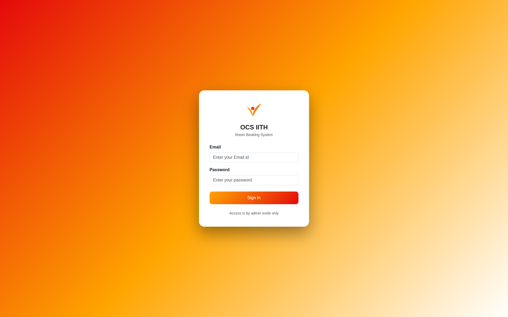
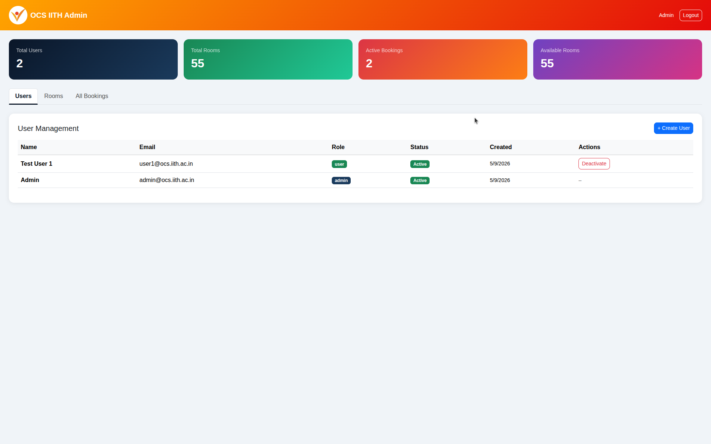
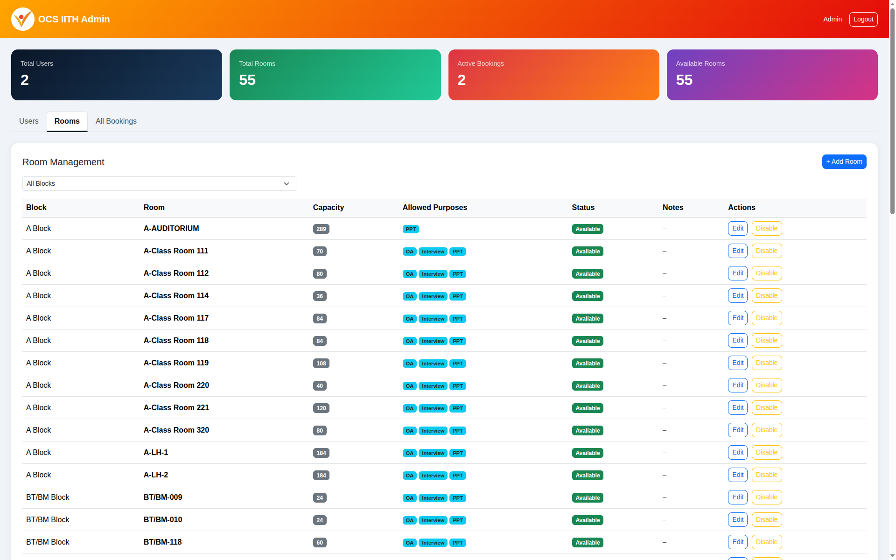
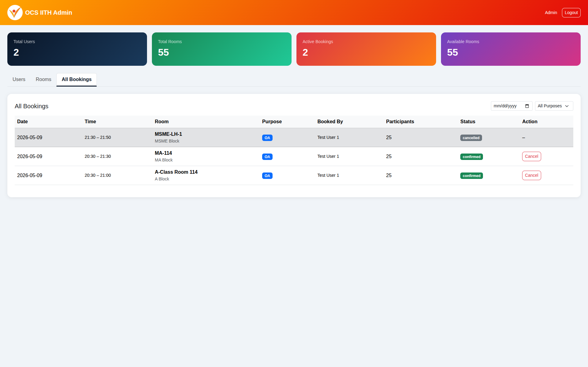
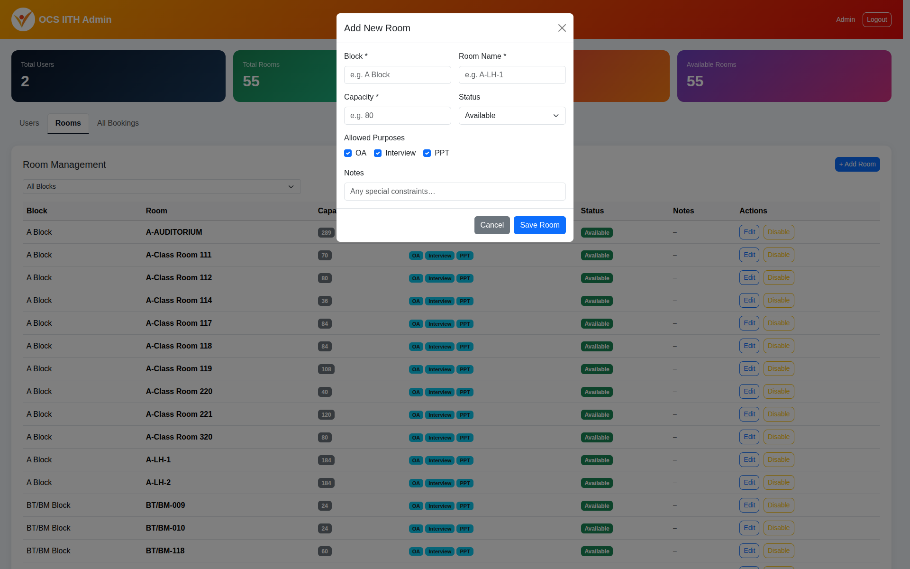
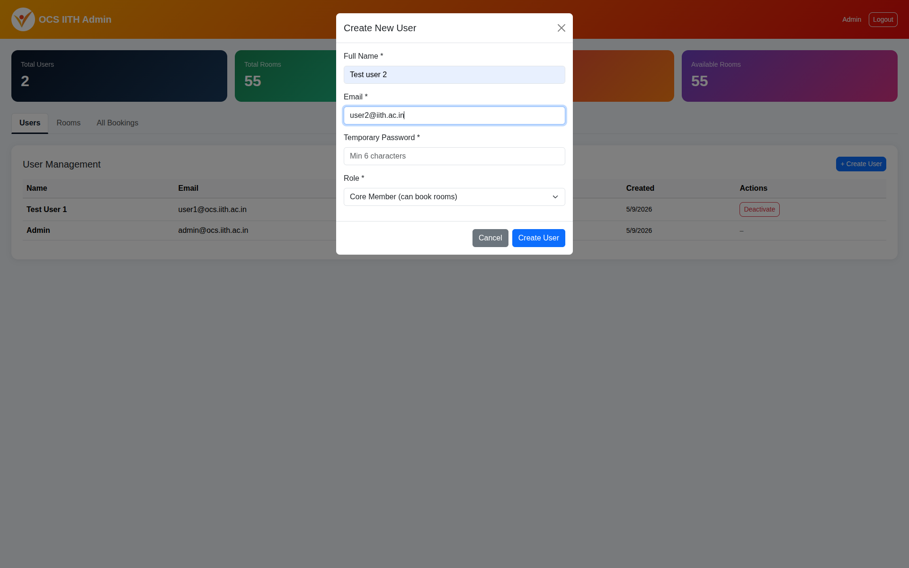
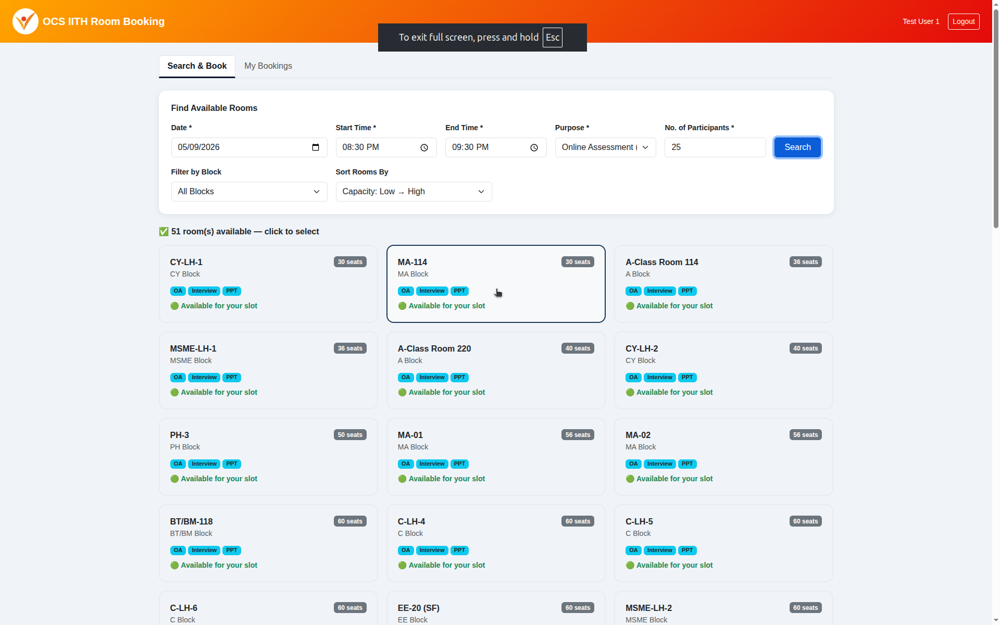
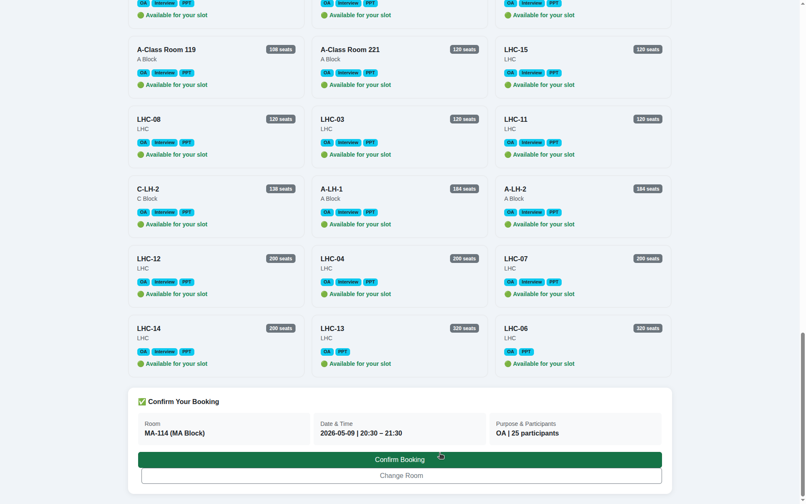
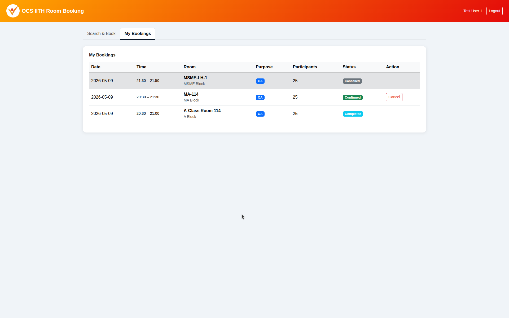

# Task-for-Tech-Cell-Coordinator-Selection-OCS-IITH-May-2026
# OCS IITH Room Booking System

A secure web-based room booking system for the Office of Career Services, IIT Hyderabad.

---

## 🚀 Live Demo

👉 [https://vmss2727.github.io/Task-for-Tech-Cell-Coordinator-Selection-OCS-IITH-May-2026/](https://vmss2727.github.io/Task-for-Tech-Cell-Coordinator-Selection-OCS-IITH-May-2026/)

Launch the above URL in your browser to access the system.

### Admin Credentials
| Field | Value |
|-------|-------|
| Email | admin@ocs.iith.ac.in |
| Password | 1q2w3e4r5t |

### User Credentials
| Field | Value |
|-------|-------|
| Email | user1@ocs.iith.ac.in |
| Password | 1q2w3e4r5t |

---

## 🛠️ Run Locally

1. Clone the repository
2. Open `index.html` with VS Code Live Server
3. Login with the credentials above
4. The Supabase database is already set up and live — no extra setup needed

---

## 📸 Screenshots

### Login Page


### Admin — Users Tab


### Admin — Rooms Tab


### Admin — All Bookings Tab


### Admin — Create New Room


### Admin — Create User


### User — Search Room


### User — Confirm Booking


### User — My Bookings Tab


---

## 🧰 Tech Stack

- **Frontend:** HTML, CSS, JavaScript, Bootstrap 5
- **Backend:** Supabase (Authentication + Database + API)
- **Database:** PostgreSQL (via Supabase)
- **Hosting:** GitHub Pages + Supabase Cloud

---

## ✅ Features

- Admin-only user creation (no self-registration)
- Role-based access: Admin / User / Viewer
- 55 IITH rooms pre-loaded across all campus blocks
- Room search by date, time, purpose, and participants
- Conflict detection — no double booking
- Capacity check — rooms must fit all participants
- Purpose validation — OA / Interview / PPT only
- Admin can cancel any booking
- Users can cancel their own bookings

---

## 📁 File Structure

```
├── index.html                      ← Login page
├── admin.html                      ← Admin dashboard
├── dashboard.html                  ← User booking page
├── config.js                       ← Supabase configuration
├── logo.jpeg                       ← OCS logo
├── user.text                       ← Admin,User credentials
├── OCS_IITH_Full_Task_Document.pdf ← Task Details
├── creating_tables.sql             ← Create tables sql query
├── insert_rooms.sql                ← Insert rooms sql query
├── rls_policies.sql                ← RLS Policies sql query
└── Screenshots                     ← Screenshots
```
